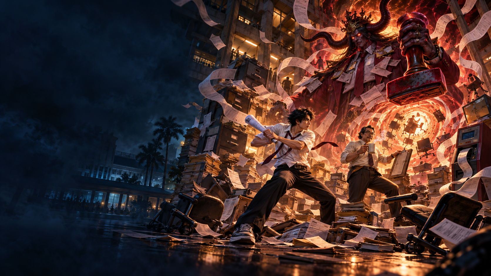
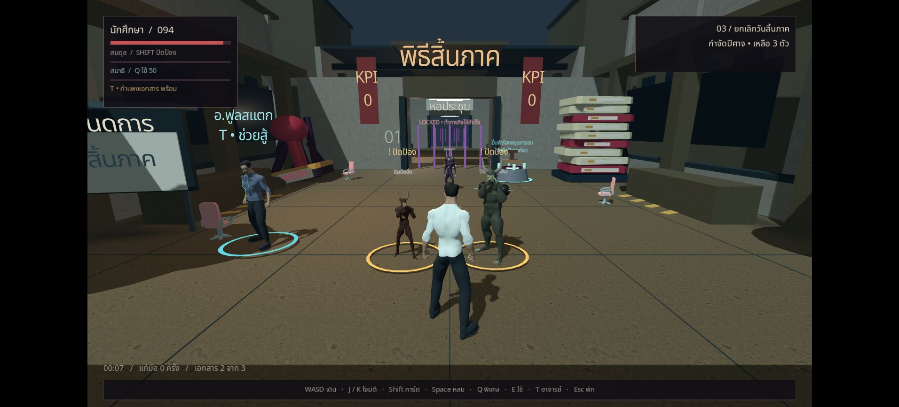
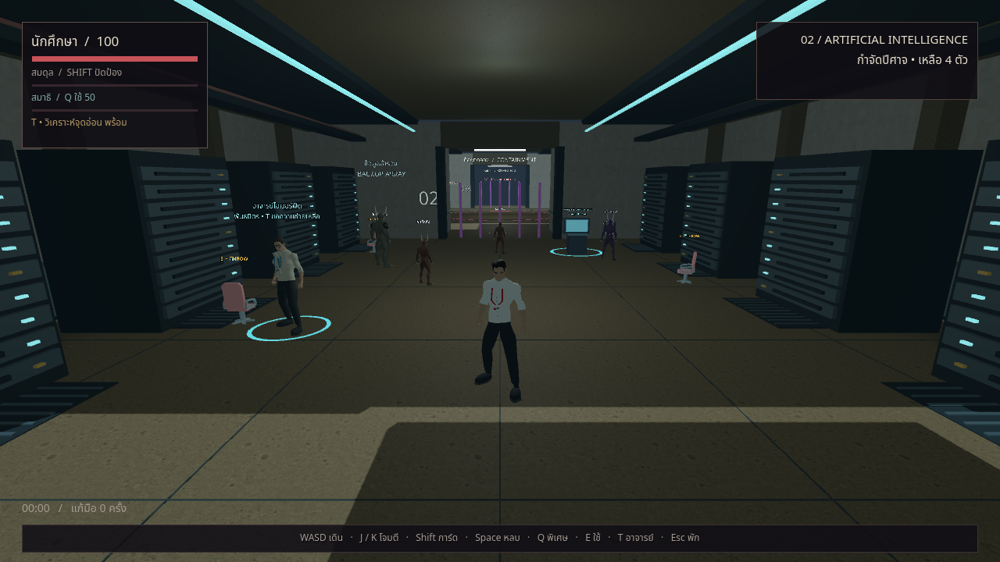
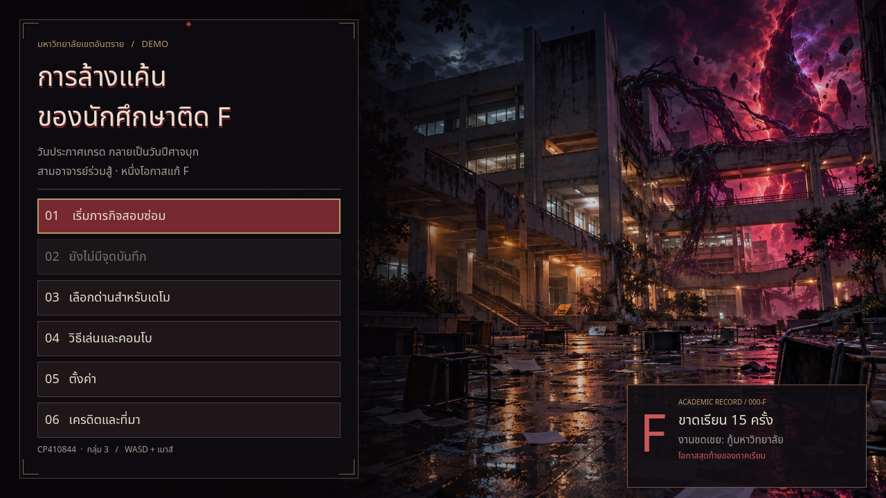

# การล้างแค้นของนักศึกษาติด F

เดโมเกมต่อสู้สามมิติสำหรับรายวิชา **CP410844 — Group 3** พัฒนาด้วย **Godot 4.7.2** และแก้โมเดล/แอนิเมชันด้วย **Blender 5.2.2 LTS**

มหาวิทยาลัยจ้าง **ยมทะเบียน** มาทำให้ “นักศึกษาตกค้างเป็นศูนย์” มันเลยจะลบนักศึกษาทั้งมหาลัยตอนเที่ยงคืน! คุณติด F จริงเพราะโดดเรียนทุกคาบ แต่ฐานเช็กชื่อไม่มีรูปหน้า ระบบจึงล็อกเป้าไม่เจอ อาจารย์สามคนต้องพึ่งคุณฝ่าคิว 666 พิสูจน์ความเป็นคน แล้วไปต่อยฝ่ายอนุมัติเพื่อยกเลิกคำสั่งลบ ปีศาจยังตีคุณได้ตามปกติ—รอดจากระบบ ไม่ได้รอดจากหมัด

**รุ่นปัจจุบัน: เดโม 0.5 — 1 ตุลาคม 2026** เรื่องสยองขวัญตลกร้ายเกี่ยวกับงานทะเบียน 3 ด่าน 9 จุดเริ่มใหม่ ปิดเรื่องด้วยงานสอบซ่อม **F → D** และมุก “D ย่อว่า เดินมาเรียนด้วย” อ่านเหตุผลเลือกพล็อตและบททั้งหมดใน [STORY.md](STORY.md) ผลตรวจจริงและข้อจำกัดอยู่ใน [VALIDATION.md](VALIDATION.md)

**สถานะเว็บ 0.5:** เผยแพร่แล้วจาก commit `eacaeae` ตรวจ HTTP 200 และ SHA-256 ตรงครบเก้าไฟล์ใน [publication 0.5](Verification/publication_v0_5.json) เปิดเกมบน Edge จากลิงก์จริงแล้ว ผล FPS native ไม่ใช้แทนผลเว็บหรือเครื่องสเปกต่ำ

- Repository: [Avocadough/f-student-revenge](https://github.com/Avocadough/f-student-revenge)
- เล่นเดโม: [GitHub Pages](https://avocadough.github.io/f-student-revenge/) — ใช้คอมพิวเตอร์ คีย์บอร์ดและเมาส์; หากเห็นภาพรุ่นเก่าให้กด Ctrl+F5

## เล่นอะไรใน 0.5

| ด่าน | เรื่องและการเล่น |
|---|---|
| คิวที่ 666 | ช่วยอาจารย์ ฝ่าเครื่องคิวและเครื่องถ่ายเอกสาร เอาใบ F ไปยืนยันตัวตน บอสใช้ตรายางยักษ์—ล่อให้ศัตรูเข้าวงแล้วหลบได้ |
| CAPTCHA จับโป๊ะ | ระบบไม่เชื่อว่าคนไม่เคยเข้าเรียนจะเป็นนักศึกษา กู้รายชื่อเพื่อนและสู้บอสจับคอมโบซ้ำ เปลี่ยนท่าและเรียกอาจารย์ช่วย |
| ยกเลิกวันสิ้นภาค | คำร้องฉุกเฉินต้องรอ 90 วัน! กันปีศาจสองระลอกเพื่อรับรองสองสำเนา ทำลายตราคุ้มกันยมทะเบียน แล้วกด E ยกเลิกคำสั่งลบ |

- มุกประจำห้องขึ้นเมื่อปลอดภัย กดเล่นต่อหรือ Esc/P เพื่อข้าม ไม่มีเสียงพากย์
- ฉากใหม่มีป้ายคิว 666 เครื่องถ่ายเอกสารยักษ์ แผง CAPTCHA กองแฟ้ม และตรายางเหนือประตูมิติ
- ฟอนต์ป้ายในฉากใช้ MSDF แยกจาก UI พร้อมตัวอักษรใหญ่และข้อความสั้น พื้นผิวยังมี mipmap และ anisotropic 4×
- โหมดคมชัดเพิ่มเพดานเป็น 1080p/4× MSAA; โหมดประหยัดเป็น 720p/2× MSAA และลดเงา แสง ประกาย ทั้งสองจำกัด 60 FPS
- เซฟ v2 เดิมยังอ่านได้ แนะนำเริ่มใหม่เพื่อเห็นเรื่องครบ ไม่เพิ่มระบบกระเป๋าเอกสารหรือบัญชีออนไลน์

## สิ่งที่เปลี่ยนใน 0.4.1

- ลดลายเม็ดบนพื้น ผนัง และเพดานด้วย mipmap และการกรองพื้นผิวมุมเฉียง 4× ทั้งสองระดับภาพ
- ภาพระยะกลางและไกลสะอาดขึ้น โดยยังเก็บรอยคราบใกล้ตัว คงความละเอียด 3D เดิมและเพดาน 60 FPS
- ตรวจภาพมุมเดียวกันครบสามด่านทั้งมาตรฐานและประหยัด; native บนเครื่องทดสอบเฉลี่ย 60.23 FPS, p95 17.85 ms
- แพ็กดาวน์โหลดเพิ่มประมาณ 1.7 MiB และข้อมูลพื้นผิวที่ถอดรหัสเพิ่ม 5.33 MiB; ยังไม่ใช่การรับรองเครื่องสเปกต่ำ

## สิ่งที่เปลี่ยนใน 0.4

- UI ธีมดำหม่น แดงเลือด และทองเก่า: หน้าเมนู บทนำ เลือกด่าน วิธีเล่น ตั้งค่า เครดิต พักเกม แพ้ ผ่านด่าน ตอนจบ และ HUD
- ปุ่มและสวิตช์มีสถานะชัดเจน หน้าข้อความยาวเลื่อนได้ทั้งเมาส์และ Tab; แยกคำเตือน ภารกิจ และบอสเพื่อไม่บังกัน
- หน้าโหลดและข้อผิดพลาดของเว็บเป็นภาษาไทยพร้อมแถบดาวน์โหลดจริง ไม่มีภาพใหญ่หรือฟอนต์ภายนอกเพิ่ม
- ตัดฉาก 3D ที่ถูกภาพเมนูบัง จำกัดการเรนเดอร์ 60 FPS และจำกัดความละเอียด 3D แยกจาก UI คมชัดบนจอ DPI สูง
- โหมดประหยัดลดเงา แสง และประกาย ในฉากทดสอบ native จำนวนคำสั่งวาดลดจาก 301 เหลือ 148; ยังไม่ได้รับรอง FPS บนเครื่องสเปกต่ำ ดู [ผลตรวจและข้อจำกัด](VALIDATION.md)

## เนื้อเรื่องและการเล่นที่เพิ่มใน 0.3

- อาจารย์ทั้งสามเป็นพันธมิตร ผู้เล่นต่อสู้ปีศาจและอุปกรณ์ที่ถูกสิง การจบเรื่องใช้การปิดผนึกประตูมิติ ไม่ใช้การทำลายระบบเกรด
- กด **T** เรียกความช่วยเหลือเฉพาะบทบาท หลังช่วยอาจารย์แล้ว รอ **15 วินาที** ก่อนใช้ครั้งถัดไป
- ทุกพื้นที่ต้องกำจัดศัตรูและกด **E** ที่อุปกรณ์ภารกิจจึงผ่านไปต่อได้ หอประชุมที่ถูกยึดในด่านสุดท้ายมีการต่อสู้สองระลอกระหว่างเปิดเครื่องผนึก
- ฉากเก้าพื้นที่มีองค์ประกอบต่างกัน เช่น ลานประกาศเกรด ทางเดินไฟฉุกเฉิน ห้องไฟฟ้า ห้องเซิร์ฟเวอร์ หอประชุม และลานประตูปีศาจ ใช้พื้นผิวจริงร่วมกับโมเดลที่ปรับแต่งสำหรับเดโม
- ปรับรูปร่างและชุดนักศึกษา/อาจารย์ เพิ่มปีศาจ 6 โมเดลโดยใช้โครงกระดูกและคลิปเดิมต่อยอด เพิ่มเสียงบรรยากาศและเสียงภารกิจ
- แคมเปญใหม่ใช้ไฟล์เซฟรุ่น 2 แยกจากเซฟเรื่องเดิม โดยเก็บไฟล์เดิมไว้

## เปิดเล่นจากต้นฉบับ

1. เปิด `project.godot` ด้วย **Godot 4.7.2 Standard** แล้วรอนำเข้าไฟล์ให้เสร็จ ไม่ต้องใช้รุ่น .NET
2. กด **F5** แล้วเลือก **เริ่มภารกิจสอบซ่อม** เพื่อดูบทนำและเล่นตามลำดับ หรือ **เลือกด่านสำหรับเดโม** เพื่อสาธิตแต่ละบท
3. หากต้องการแก้โมเดล ใช้ไฟล์ `.blend` ใน [Art/](Art/) ส่วนผู้เล่นที่ใช้ `.glb` ที่เตรียมไว้ไม่ต้องติดตั้ง Blender

## การควบคุม

| ปุ่ม | การทำงาน |
| --- | --- |
| WASD / ปุ่มลูกศร | เคลื่อนที่ตามทิศกล้อง |
| เมาส์ | หมุนกล้อง |
| ลากปุ่มเมาส์กลาง | หมุนกล้องเมื่อเบราว์เซอร์ไม่อนุญาตให้จับเมาส์ |
| คลิกซ้าย / J | โจมตีเบา — L |
| คลิกขวา / K | โจมตีหนัก — H |
| Shift ค้าง / กดก่อนถูกโจมตี | ตั้งการ์ด / ปัดป้อง |
| Space + ทิศทาง | หลบ |
| Q | ท่าพิเศษ ใช้เกจสมาธิ |
| E | ใช้อุปกรณ์ภารกิจเมื่อพื้นที่ปลอดภัย / ปิดฉากศัตรูเสียหลัก / ใช้สิ่งของใกล้ตัว |
| T | ขอความช่วยเหลือจากอาจารย์ รอ 15 วินาทีระหว่างการใช้ |
| R | หันกล้องกลับหลังผู้เล่น |
| Esc / P | พักเกม |

คอมโบหลักคือ **LLL**, **LLH**, **LHL** อ่านคำเตือนก่อนโจมตี ท่าอันตรายบางชนิดต้องหลบ เมื่อกำจัดศัตรูครบให้เดินไปจุดภารกิจสีฟ้าแล้วกด **E**; ชนะบอสอย่างเดียวยังไม่จบภารกิจ

| อาจารย์ | ความช่วยเหลือด้วย T |
| --- | --- |
| เซมิโคลอน — สั่งพักราชการ | ขัดจังหวะปีศาจในระยะและเพิ่มการเสียสมดุล |
| โอเวอร์ฟิต — จับโป๊ะจุดอ่อน | เปิดช่องโจมตีการตั้งรับและล้างการอ่านคอมโบซ้ำชั่วคราว |
| ฟูลสแตก — กำแพงเอกสาร | สร้างเขตป้องกันกระสุนที่ตำแหน่งขณะเรียก ใช้ได้ 6 วินาที |

อาจารย์ช่วยจากตำแหน่งประจำพื้นที่ ไม่ใช่ผู้เล่นคนที่สองหรือระบบเพื่อนร่วมทีมเดินตามเต็มรูปแบบ กำแพงป้องกันกระสุนไม่ทำให้ผู้เล่นเป็นอมตะจากการโจมตีประชิด

## เซฟและการตั้งค่า

แคมเปญ 0.3 ใช้ `user://progress_v2.json` หากยังไม่มีไฟล์ใหม่นี้ เกมอ่านค่าตั้งค่าที่ถูกต้องจาก `user://progress.json` รุ่นเก่า แต่ไม่ย้าย checkpoint เรื่องเดิมมาใช้กับเนื้อเรื่องใหม่ และไม่เขียนทับไฟล์เดิม การบันทึกอยู่ในเครื่อง/เบราว์เซอร์ ไม่ใช่บัญชีออนไลน์ การล้างข้อมูลเว็บไซต์อาจลบความคืบหน้า

- **คมชัด:** ความละเอียด 3D สูงสุด 1920×1080 ตามขนาดจอ, ลบรอยหยัก 4× และเปิดเงาของแสงหลัก จำกัด 60 FPS
- **ประหยัด:** ความละเอียด 3D สูงสุด 1280×720, ลบรอยหยัก 2× ปิดเงา ลดไฟตกแต่งและประกาย จำกัด 60 FPS ใช้พิกเซลน้อยกว่าโหมดคมชัดบนจอใหญ่ UI ยังแยกความละเอียดจากฉาก
- **God Mode:** อมตะและกำจัดเป้าหมายเมื่อโจมตีโดนครั้งเดียว ค่าเริ่มต้นปิด HUD ระบุเมื่อเปิด ใช้เซฟแคมเปญเดียวกับการเล่นปกติ ผู้เล่นยังต้องทำภารกิจด้วย E และผ่านจุดต่าง ๆ ตามลำดับ

## ส่งออกเวอร์ชันเว็บ

1. ติดตั้ง Export Templates ให้ตรงกับ Godot **4.7.2**
2. เลือก **Project → Export → Web** ส่งออกไป `docs/index.html` ตาม preset
3. รัน `python -m http.server 8080 --directory docs` แล้วเปิด [localhost:8080](http://localhost:8080/) ผ่าน Chrome หรือ Edge
4. กดเริ่มเกมเพื่อเปิดเสียงและจับเมาส์ ทดสอบพัก/เล่นต่อ ทั้งภาพปกติและภาพประหยัด ก่อนใช้ชุดนั้นนำเสนอ

ไฟล์เว็บต้องโหลดผ่าน HTTP ไม่ใช้การดับเบิลคลิก `index.html` เวอร์ชันนี้ใช้ Compatibility renderer และ Web export แบบ single-thread

## ขอบเขตและข้อจำกัด

- เล่นคนเดียวบนคอมพิวเตอร์ด้วยคีย์บอร์ดและเมาส์ มี 3 ด่าน ด่านละ 3 checkpoint ไม่มี Multiplayer, open world หรือปุ่มสัมผัสสำหรับมือถือ
- ตั้งเป้าเวลาเล่นครั้งแรก **20–30 นาที** แต่ยังไม่ยืนยันด้วยผู้เล่นใหม่ที่เล่นต่อเนื่องครบเกม ผล bot ไม่ใช้แทนเวลาเล่นหรือความสนุกของคน
- งานภาพเป็นเดโมสามมิติที่ใช้พื้นผิวจริงผสมกับโมเดลปรับแต่งและฉากแบบโมดูล ยังไม่อ้างว่าทุกองค์ประกอบสมจริงหรือได้คุณภาพระดับเกมเชิงพาณิชย์
- ประสิทธิภาพขึ้นกับเครื่อง เบราว์เซอร์ และระดับภาพ ผล native ระหว่างพัฒนาที่เก็บก่อน reimport โมเดลรุ่นสุดท้ายไม่ใช่ผลของชุดสุดท้าย และไม่ยืนยัน FPS บนเว็บหรือเครื่องสเปกต่ำ
- บทพูด จออุปกรณ์ และภาพหน้าปกสร้างสำหรับเกม ไม่มีภาพเหมือนอาจารย์จริงหรือวิดีโอจากสื่อสังคมจริง

## เอกสารและประวัติ

[DESIGN.md](DESIGN.md) อธิบายระบบปัจจุบัน, [IMPROVEMENT_PLAN.md](IMPROVEMENT_PLAN.md) แยกงาน 0.3 จากประวัติ 0.2, [VALIDATION.md](VALIDATION.md) บันทึกผลตรวจและสถานะเผยแพร่

รุ่น **0.2** ปรับ interpolation, Run/Hook, การชน, UI, batching และ God Mode พร้อมหลักฐานทดสอบของเรื่องเดิม หลักฐานเหล่านั้นยังเก็บไว้เพื่อเทียบประวัติ แต่ไม่ใช้ยืนยันว่าเนื้อเรื่องหรือภารกิจ 0.3 ผ่านการตรวจแล้ว

โครงการต่อยอดลำดับเมนูจาก `3D-lab1` / Silver Demon Studios และปรับระบบเคลื่อนที่/กล้องจาก Jeh3no ดู [CREDITS.md](CREDITS.md), [Asset manifest](Assets/asset_manifest.json) และ [LICENSE](LICENSE) รายงานที่มีข้อมูลสมาชิกเก็บแยกจาก repository สาธารณะ
