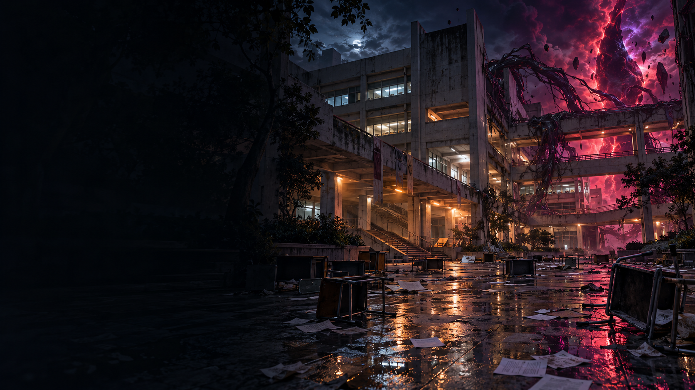

# การล้างแค้นของนักศึกษาติด F

เดโมเกมต่อสู้สามมิติสำหรับรายวิชา **CP410844 — Group 3** พัฒนาด้วย **Godot 4.7.2** และแก้โมเดล/แอนิเมชันด้วย **Blender 5.2.2 LTS**

นักศึกษาที่โดดเรียนบ่อยได้รับ **เกรด F** ในวันประกาศผล แต่ยังไม่ทันไปเถียงอาจารย์ ปีศาจก็บุกมหาวิทยาลัย ทั้งสองฝ่ายจึงร่วมมือกันช่วยผู้รอดชีวิต เปิดระบบสำคัญ และปิดประตูมิติ อาจารย์นับภารกิจนี้เป็นงานสอบซ่อมภาคสนาม ประเมินการแก้ปัญหา การร่วมมือ และความรับผิดชอบ ก่อนเปลี่ยนผลการเรียน **F → D** พร้อมกำชับว่า “คาบหน้าก็มาเรียนด้วย” ชื่อเกมยังคงเดิม ตัวละครและมหาวิทยาลัยเป็นเรื่องสมมติ

**รุ่นปัจจุบัน: เดโม 0.3 — 1 ตุลาคม 2026** เปลี่ยนเป็นแคมเปญร่วมมือกับอาจารย์ 3 ด่าน 9 จุดเริ่มใหม่ พร้อมศัตรูปีศาจ ภารกิจประจำพื้นที่ และฉากมหาวิทยาลัยบรรยากาศหลอน รายละเอียดการตรวจจริงและข้อจำกัดให้ยึด [VALIDATION.md](VALIDATION.md)

**สถานะเว็บ 0.3:** อยู่ระหว่างการตรวจชุดเผยแพร่และประสิทธิภาพในเบราว์เซอร์ การมีไฟล์ส่งออกในโครงการยังไม่ยืนยันว่าเว็บสาธารณะเป็นรุ่นนี้ หลักฐานเว็บที่ยืนยันไว้ก่อนหน้านี้เป็น **รุ่น 0.2 เมื่อ 24 กันยายน 2026** เท่านั้น ดู [บันทึกการเผยแพร่เดิม](Verification/publication_v0_2.json)

- Repository: [Avocadough/f-student-revenge](https://github.com/Avocadough/f-student-revenge)
- ที่อยู่เว็บโครงการ: [GitHub Pages](https://avocadough.github.io/f-student-revenge/) — ตรวจสถานะรุ่นจาก VALIDATION ก่อนอ้างว่าเป็น 0.3

## สิ่งที่เปลี่ยนใน 0.3

- อาจารย์ทั้งสามเป็นพันธมิตร ผู้เล่นต่อสู้ปีศาจและอุปกรณ์ที่ถูกสิง การจบเรื่องใช้การปิดผนึกประตูมิติ ไม่ใช้การทำลายระบบเกรด
- กด **T** เรียกความช่วยเหลือเฉพาะบทบาท หลังช่วยอาจารย์แล้ว รอ **15 วินาที** ก่อนใช้ครั้งถัดไป
- ทุกพื้นที่ต้องกำจัดศัตรูและกด **E** ที่อุปกรณ์ภารกิจจึงผ่านไปต่อได้ หอประชุมที่ถูกยึดในด่านสุดท้ายมีการต่อสู้สองระลอกระหว่างเปิดเครื่องผนึก
- ฉากเก้าพื้นที่มีองค์ประกอบต่างกัน เช่น ลานประกาศเกรด ทางเดินไฟฉุกเฉิน ห้องไฟฟ้า ห้องเซิร์ฟเวอร์ หอประชุม และลานประตูปีศาจ ใช้พื้นผิวจริงร่วมกับโมเดลที่ปรับแต่งสำหรับเดโม
- ปรับรูปร่างและชุดนักศึกษา/อาจารย์ เพิ่มปีศาจ 6 โมเดลโดยใช้โครงกระดูกและคลิปเดิมต่อยอด เพิ่มเสียงบรรยากาศและเสียงภารกิจ
- แคมเปญใหม่ใช้ไฟล์เซฟรุ่น 2 แยกจากเซฟเรื่องเดิม โดยเก็บไฟล์เดิมไว้

## เปิดเล่นจากต้นฉบับ

1. เปิด `project.godot` ด้วย **Godot 4.7.2 Standard** แล้วรอนำเข้าไฟล์ให้เสร็จ ไม่ต้องใช้รุ่น .NET
2. กด **F5** แล้วเลือก **เริ่มล้างแค้น** เพื่อดูบทนำและเล่นตามลำดับ หรือ **เลือกด่านสำหรับเดโม** เพื่อสาธิตแต่ละบท
3. หากต้องการแก้โมเดล ใช้ไฟล์ `.blend` ใน [Art/](Art/) ส่วนผู้เล่นที่ใช้ `.glb` ที่เตรียมไว้ไม่ต้องติดตั้ง Blender

## การควบคุม

| ปุ่ม | การทำงาน |
| --- | --- |
| WASD / ปุ่มลูกศร | เคลื่อนที่ตามทิศกล้อง |
| เมาส์ | หมุนกล้อง |
| ลากปุ่มเมาส์กลาง | หมุนกล้องเมื่อเบราว์เซอร์ไม่อนุญาตให้จับเมาส์ |
| คลิกซ้าย / J | โจมตีเบา — L |
| คลิกขวา / K | โจมตีหนัก — H |
| Shift ค้าง / กดก่อนถูกโจมตี | ตั้งการ์ด / ปัดป้อง |
| Space + ทิศทาง | หลบ |
| Q | ท่าพิเศษ ใช้เกจสมาธิ |
| E | ใช้อุปกรณ์ภารกิจเมื่อพื้นที่ปลอดภัย / ปิดฉากศัตรูเสียหลัก / ใช้สิ่งของใกล้ตัว |
| T | ขอความช่วยเหลือจากอาจารย์ รอ 15 วินาทีระหว่างการใช้ |
| R | หันกล้องกลับหลังผู้เล่น |
| Esc / P | พักเกม |

คอมโบหลักคือ **LLL**, **LLH**, **LHL** อ่านคำเตือนก่อนโจมตี ท่าอันตรายบางชนิดต้องหลบ เมื่อกำจัดศัตรูครบให้เดินไปจุดภารกิจสีฟ้าแล้วกด **E**; ชนะบอสอย่างเดียวยังไม่จบภารกิจ

| อาจารย์ | ความช่วยเหลือด้วย T |
| --- | --- |
| เซมิโคลอน — Programming | ขัดจังหวะปีศาจในระยะและเพิ่มการเสียสมดุล |
| โอเวอร์ฟิต — AI | เปิดช่องโจมตีการตั้งรับและล้างการอ่านคอมโบซ้ำชั่วคราว |
| ฟูลสแตก — Web App | สร้างเขตป้องกันกระสุนที่ตำแหน่งขณะเรียก ใช้ได้ 6 วินาที |

อาจารย์ช่วยจากตำแหน่งประจำพื้นที่ ไม่ใช่ผู้เล่นคนที่สองหรือระบบเพื่อนร่วมทีมเดินตามเต็มรูปแบบ กำแพงป้องกันกระสุนไม่ทำให้ผู้เล่นเป็นอมตะจากการโจมตีประชิด

## เซฟและการตั้งค่า

แคมเปญ 0.3 ใช้ `user://progress_v2.json` หากยังไม่มีไฟล์ใหม่นี้ เกมอ่านค่าตั้งค่าที่ถูกต้องจาก `user://progress.json` รุ่นเก่า แต่ไม่ย้าย checkpoint เรื่องเดิมมาใช้กับเนื้อเรื่องใหม่ และไม่เขียนทับไฟล์เดิม การบันทึกอยู่ในเครื่อง/เบราว์เซอร์ ไม่ใช่บัญชีออนไลน์ การล้างข้อมูลเว็บไซต์อาจลบความคืบหน้า

- **ภาพปกติ:** ความละเอียดการเรนเดอร์ 3D เต็มและเปิดเงาของแสงหลัก
- **ภาพประหยัด:** ลดสัดส่วนความละเอียด 3D เป็น 75% และปิดเงาของแสงหลัก ควรทดลองทั้งสองระดับบนเครื่องที่จะนำเสนอ
- **God Mode:** อมตะและกำจัดเป้าหมายเมื่อโจมตีโดนครั้งเดียว ค่าเริ่มต้นปิด HUD ระบุเมื่อเปิด ใช้เซฟแคมเปญเดียวกับการเล่นปกติ ผู้เล่นยังต้องทำภารกิจด้วย E และผ่านจุดต่าง ๆ ตามลำดับ

## ส่งออกเวอร์ชันเว็บ

1. ติดตั้ง Export Templates ให้ตรงกับ Godot **4.7.2**
2. เลือก **Project → Export → Web** ส่งออกไป `docs/index.html` ตาม preset
3. รัน `python -m http.server 8080 --directory docs` แล้วเปิด [localhost:8080](http://localhost:8080/) ผ่าน Chrome หรือ Edge
4. กดเริ่มเกมเพื่อเปิดเสียงและจับเมาส์ ทดสอบพัก/เล่นต่อ ทั้งภาพปกติและภาพประหยัด ก่อนใช้ชุดนั้นนำเสนอ

ไฟล์เว็บต้องโหลดผ่าน HTTP ไม่ใช้การดับเบิลคลิก `index.html` เวอร์ชันนี้ใช้ Compatibility renderer และ Web export แบบ single-thread

## ขอบเขตและข้อจำกัด

- เล่นคนเดียวบนคอมพิวเตอร์ด้วยคีย์บอร์ดและเมาส์ มี 3 ด่าน ด่านละ 3 checkpoint ไม่มี Multiplayer, open world หรือปุ่มสัมผัสสำหรับมือถือ
- ตั้งเป้าเวลาเล่นครั้งแรก **20–30 นาที** แต่ยังไม่ยืนยันด้วยผู้เล่นใหม่ที่เล่นต่อเนื่องครบเกม ผล bot ไม่ใช้แทนเวลาเล่นหรือความสนุกของคน
- งานภาพเป็นเดโมสามมิติที่ใช้พื้นผิวจริงผสมกับโมเดลปรับแต่งและฉากแบบโมดูล ยังไม่อ้างว่าทุกองค์ประกอบสมจริงหรือได้คุณภาพระดับเกมเชิงพาณิชย์
- ประสิทธิภาพขึ้นกับเครื่อง เบราว์เซอร์ และระดับภาพ ผล native ระหว่างพัฒนาที่เก็บก่อน reimport โมเดลรุ่นสุดท้ายไม่ใช่ผลของชุดสุดท้าย และไม่ยืนยัน FPS บนเว็บหรือเครื่องสเปกต่ำ
- บทพูด จออุปกรณ์ และภาพหน้าปกสร้างสำหรับเกม ไม่มีภาพเหมือนอาจารย์จริงหรือวิดีโอจากสื่อสังคมจริง

## เอกสารและประวัติ

[DESIGN.md](DESIGN.md) อธิบายระบบปัจจุบัน, [IMPROVEMENT_PLAN.md](IMPROVEMENT_PLAN.md) แยกงาน 0.3 จากประวัติ 0.2, [VALIDATION.md](VALIDATION.md) บันทึกผลตรวจและสถานะเผยแพร่

รุ่น **0.2** ปรับ interpolation, Run/Hook, การชน, UI, batching และ God Mode พร้อมหลักฐานทดสอบของเรื่องเดิม หลักฐานเหล่านั้นยังเก็บไว้เพื่อเทียบประวัติ แต่ไม่ใช้ยืนยันว่าเนื้อเรื่องหรือภารกิจ 0.3 ผ่านการตรวจแล้ว

โครงการต่อยอดลำดับเมนูจาก `3D-lab1` / Silver Demon Studios และปรับระบบเคลื่อนที่/กล้องจาก Jeh3no ดู [CREDITS.md](CREDITS.md), [Asset manifest](Assets/asset_manifest.json) และ [LICENSE](LICENSE) รายงานที่มีข้อมูลสมาชิกเก็บแยกจาก repository สาธารณะ
